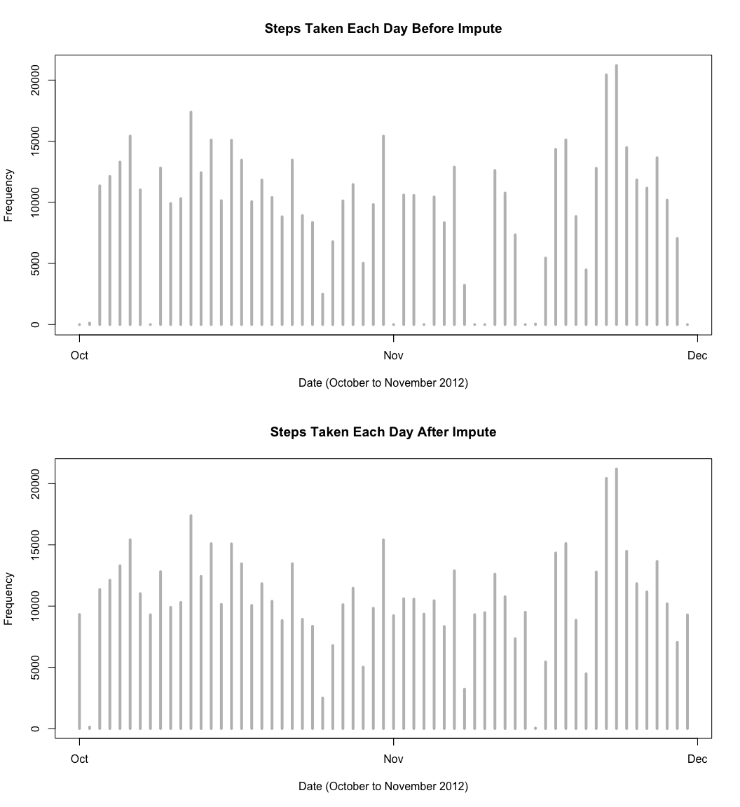
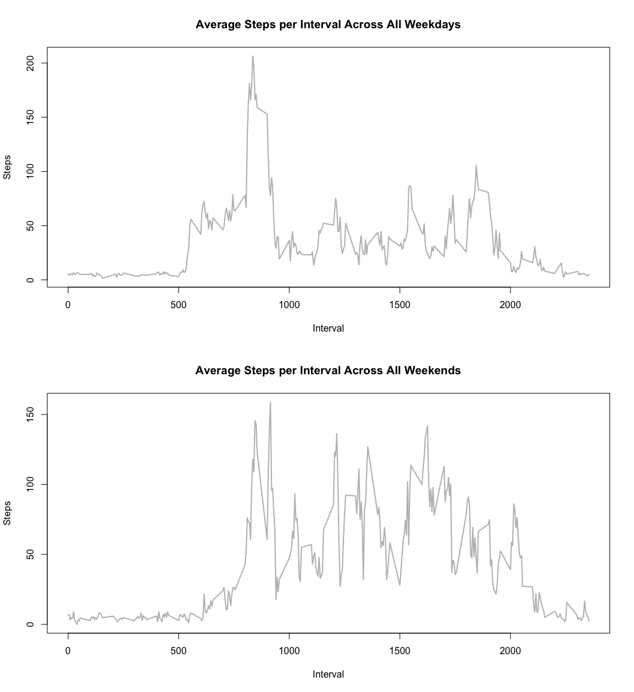

## Loading and preprocessing the data

1. Setting global options and loading required libraries

```r
library(knitr)
library(ggplot2)
library(data.table)
opts_chunk$set(echo = TRUE, results = 'hold')
```

2. Load the data

```r
unzip("activity.zip")
activity_data <- read.csv("activity.csv", header=TRUE, sep=",")
str(activity_data)
```

```
## 'data.frame':	17568 obs. of  3 variables:
##  $ steps   : int  NA NA NA NA NA NA NA NA NA NA ...
##  $ date    : Factor w/ 61 levels "2012-10-01","2012-10-02",..: 1 1 1 1 1 1 1 1 1 1 ...
##  $ interval: int  0 5 10 15 20 25 30 35 40 45 ...
```

3. Convert some of the vectors to appropriate forms

```r
# Turn date data into a valid date class
# Dates are in YYYY-MM-DD format
dates <- strptime(activity_data$date, "%Y-%m-%d")
activity_data$date <-dates
str(activity_data)

# Keep a list of all possible days
unique_dates <- unique(dates)
# Keep a list of all possible intervals
unique_intervals <- unique(activity_data$interval)
```

```
## 'data.frame':	17568 obs. of  3 variables:
##  $ steps   : int  NA NA NA NA NA NA NA NA NA NA ...
##  $ date    : POSIXlt, format: "2012-10-01" "2012-10-01" ...
##  $ interval: int  0 5 10 15 20 25 30 35 40 45 ...
```

4. Print the header of the data

```r
head(activity_data)
```

```
##   steps       date interval
## 1    NA 2012-10-01        0
## 2    NA 2012-10-01        5
## 3    NA 2012-10-01       10
## 4    NA 2012-10-01       15
## 5    NA 2012-10-01       20
## 6    NA 2012-10-01       25
```


## What is mean total number of steps taken per day?

1. Create a historgram of the total number of steps taken each day

```r
# First, split up the data frame for steps by day
steps_per_day <- split(activity_data$steps, dates$yday)

# Next, find the total number of steps over each day
total_steps_per_day <- sapply(steps_per_day, sum, na.rm=TRUE)
```

2. Make a histogram of the total number of steps taken each day

```r
histo_steps_taken_each_day <- plot(unique_dates, total_steps_per_day, main="Steps Taken Each Day", 
     xlab="Date (October to November 2012)", ylab="Frequency", type="h", lwd=4, col="grey")
```

<!-- -->

```r
print(histo_steps_taken_each_day)
dev.copy(png,'plot1.png')
dev.off()
```

```
## NULL
## quartz_off_screen 
##                 3 
## quartz_off_screen 
##                 2
```

3. Calculate and report the mean of the total number of steps taken per day

```r
mean_steps_per_day <- sapply(steps_per_day, mean, na.rm=TRUE)
mean_data_frame <- data.frame(date=unique_dates, mean_steps_per_day = mean_steps_per_day, row.names = NULL)
head(mean_data_frame)
```

```
##         date mean_steps_per_day
## 1 2012-10-01                NaN
## 2 2012-10-02            0.43750
## 3 2012-10-03           39.41667
## 4 2012-10-04           42.06944
## 5 2012-10-05           46.15972
## 6 2012-10-06           53.54167
```

4. Calculate and report the median of the total number of steps taken per day

```r
median_steps_per_day <- sapply(steps_per_day, median, na.rm=TRUE)
median_data_frame <- data.frame(date=unique_dates, median_steps_per_day=median_steps_per_day, row.names=NULL)
head(median_data_frame)
```

```
##         date median_steps_per_day
## 1 2012-10-01                   NA
## 2 2012-10-02                    0
## 3 2012-10-03                    0
## 4 2012-10-04                    0
## 5 2012-10-05                    0
## 6 2012-10-06                    0
```

The median measure may look a bit puzzling, but if you observe the data for the amount of steps over some of the days, you will see that a majority of the steps taken are zero and so the mean would logically represent the 50th percentile. Here is a sample between October 10th to October 12th of 2012:

```r
steps_per_day[10:12]
```

```
## $`283`
##   [1]  34  18   7   0   0   0   0   0   0   0   0   0   0   0   0   0   0
##  [18]   0   0   0   0   0   0   0   0   0   0   0   0   0   0   0   0   0
##  [35]   0   0   0   0   0   0   0   0   0   0   0   0   0   0   0   0   0
##  [52]   0   0   0   0   0   0   0   0   0   0  34   0   0   0   0   0   0
##  [69]   0   0   0   0   0   7   9  36   0  47  67   0  49  23  15  29  42
##  [86]  49  92  28  33  63  97  90 101  55  75  40  47  22  61   0   0   0
## [103]   0   0   0  60  54  16 135  61  69  32   0   0  17   0   0  69   0
## [120]  20 400 105 292 291  30   0   0  40  38   0   0   0   0   0   0  72
## [137]  37   0   0  25  17   0   0  88   7 413 326  93 334 317   0   0   0
## [154]   0  68 129   0   0   0   0   0   0   0   0   0   0   0   0   0   0
## [171] 103 119   0   0   0  70 125   0   0   0   0   0   0   0   0   0 176
## [188]  71  43 340   7  13  15   0   0   0   0   0   0   0   0   0   0  15
## [205]  50 271 106 272 308   0   0 111 281  11 139  36   0   0   0   0   0
## [222]   0  58  63 260  82 310   0   0   0   8  12 364 219   0   0   0 174
## [239] 205  12   0   0  11  17   0   0  37   0   0 105  34   0 152   0   0
## [256]   0   0   0   0   0   0   0   0   0   0   0   0 112  23  12   8   0
## [273]   0   0   0   0   7   0   0   0   0   0   0   0   0   0   8   0
## 
## $`284`
##   [1]   0   0   0   8   0   0   0   0   0   0   0   0   0   0   8   0   0
##  [18]   0   0   0   0   0   0   0   0   0   0   0   0   0   0   0   0   0
##  [35]   0   0   0   0   0   0   0   0   0   0   0   0   0   0   0   0   0
##  [52]   0   0   0   0   0 139  15   0   0   0   0   0   0   0   0   0   0
##  [69]   0   0   0  11   0  10  40   0   0  32  34 105  33   8  16  18   0
##  [86]   9   0   0  27  22   0  50   0   0   0  23  43  70 619 743 446 748
## [103] 424 747 739 741 726 166 548 343  13  26  64   0   0   0   0   0   0
## [120]   0   0   0   0   0   0   0   0   0   0   0   0   0   0   0   0   0
## [137]   0   7  46   0   0   0   0   0   0   0   0  31  45   0   0   0   0
## [154]   0   0   0   0   0   0   0   0   0   0   0   0   0   0   0   0   0
## [171]   0   0   0   0  22  27   0   0   0   0   0   0   0   0   0   0  75
## [188] 119 395  78 292 416  35   0   0  27  32   0   0   0   0   0  49  57
## [205]  34   0   0   0   0   0  39  30   9  41   7   0   0  40  22  31  19
## [222]   0   8  22  62  60   0   0   0   0   0   0   0   0   0   0   0   0
## [239]   0   0   0   0   0   0   0   0   0   0   0   0   0   0   0   0  95
## [256]   0  91  50  31   0   0   0  20  11   0   0   0   0   0   0   0   0
## [273]   0   0   0   0  11   0   0   0   0   4   0   0   0   0   0   0
## 
## $`285`
##   [1]   0   0   0   0   0   0   0   0   0   0   0   0   0   0   0   0   0
##  [18]   0  38   0   0   0   0   0   0   0   0   0   0   0   0   0   0   0
##  [35]   7   0   0   0   0   0   0   0   0   0   0   0   0   0   0   0   0
##  [52]   0   0   0  48   0   0   0   0   0   0   0   0   0   0   0   0   0
##  [69]  30  92   0  11   0  10  19 111  38  16  29   9  45  35  53  43   8
##  [86]  40   0  32  57  35 117 117  25  95  29 141  51 123 440 687 614 474
## [103] 750 742 770 735 746 748 802 280  31   0   0   0   0   0   0   7  92
## [120]   0   0   0   0   0  46   7   0 328 156   0   0   0 129 339 150   0
## [137]   0   0  70   0   9   0   0   0  70   0   0   0   0   0   0   0  18
## [154]  91   0   0   0  75   0   0   0   0  99   0   0   0   0  96  16  20
## [171] 144 321 267   0   0   0   0   0   9   0   0  24  78   0  26  35   0
## [188]   0   0 365  90 432 275  34   0  92  15   0   0   0   0  20  10   9
## [205]   0   0  32  24   0   0  38  40  19  71   2  21   0 433 463 511 298
## [222] 500 473 506  24  35  41  46   0   0   0  16  23   0   0   0  18  54
## [239]  36   0   0   0   0   0   0   0   0   0   0  18  30  23  70 113   0
## [256]   0   0   0   0   0   0   0   0   0   0   0   0   9   0   0   8   0
## [273]   0   0   0   0   0   0   0   0   0   0   0   0   0   0   0   0
```


## What is the average daily activity pattern?
What we now need to do is split up this data again so that individual data frames represent the steps taken over each time interval. As such, there will be a data frame for interval 5, another data frame for interval 10 and so on. Once we extract out these individual data frames, we thus compute the mean for each time interval. It is imperative to note that we again will ignore NA values. We will thus plot the data as a time-series plot (of type="l"). Once we have done this, we will locate where in the time-series plot the maximum is located and will draw a red vertical line to denote this location:  
  

```r
# Part 3 - Time-series plot (type="l")
# x-axis - Time interval (5, 10, 15, ...)
# y-axis - Average number of steps taken across all days for this time interval

# Split up the data according to the interval
interval_split <- split(activity_data$steps, activity_data$interval)

# Find the average amount of steps per time interval - ignore NA values
average_steps_per_interval <- sapply(interval_split, mean, na.rm=TRUE)

# Plot the time-series graph
time_series_avg_per_interval <- plot(unique_intervals, average_steps_per_interval, type="l",
     main="Average Steps per Interval Across All Days", 
     xlab="Interval", ylab="Average # Steps Across All Days", 
     lwd=2, col="gray")
print(time_series_avg_per_interval)
dev.copy(png,'plot2.png')
dev.off()


# Find the location of where the maximum is
maximum_interval_days <- max(average_steps_per_interval, na.rm=TRUE)
maximum_index <- as.numeric(which(average_steps_per_interval == maximum_interval_days))

# Plot a vertical line where the max is
maximum_interval <- unique_intervals[maximum_index]
abline(v=maximum_interval, col="red", lwd=3)
```

<!-- -->

```
## NULL
## quartz_off_screen 
##                 3 
## quartz_off_screen 
##                 2
```
    
With reference to the above plot, the interval that records the maximum number of steps averaged across all days is:

```r
maximum_interval
```

```
## [1] 835
```


## Imputing missing values

Calculate and report the total number of missing values in the dataset (i.e. the total number of rows with NAs)

```r
missing_values <- sum(is.na(activity_data$steps))
missing_values
```

```
## [1] 2304
```
  
The strategy that we will use to fill in the missing values in the data set is to replace all NA values with the mean of that particular 5-minute interval the observation falls on. Now that we have devised this strategy, let’s replace all of the NA values with the aforementioned strategy.

```r
# Modify the meanStepsPerDay vector that contains the mean steps taken
# for this 5 minute interval
# Each day consists of 288 intervals and there are 61 days in total
# First remove NaN values and replace with 0.  
# NaN values are produced when the entire day was filled with NA values
# Essentially the mean and median would be zero anyway!
mean_steps_per_day[is.nan(mean_steps_per_day)] <- 0

# Now create a replicated vector 288 times
# The reason why we're doing this is because the slots
# in the vector naturally line up with the interval for
# a particular day.  Now, all we have to do is find where
# in the data set there are missing steps, and simply do
# a copy from one vector to the other
mean_column <- rep(mean_steps_per_day, 288)

# The steps before replacement
raw_steps <- activity_data$steps

# Find any values that are NA in the raw steps data
steps_NA <- is.na(raw_steps)

# Now replace these values with their corresponding mean
raw_steps[steps_NA] <- mean_column[steps_NA]

# Throw these back into a new data frame
activity_data_new <- activity_data
activity_data_new$steps <- raw_steps
```
  
Plot a histogram of the activity_data_new.

```r
# Repeat Part 2 now
# First split up the data frame for steps by day
steps_split_new <- split(activity_data_new$steps, dates$yday)

# Next find the total number of steps over each day
# There should not be an NA values and so we don't need
# to set the flag
total_steps_per_day_new <- sapply(steps_split_new, sum)

# Plot a (pseudo) histogram where the x-axis denotes the day
# and the y-axis denotes the total number of steps taken 
# for each day
par(mfcol=c(2,1))
# Plot the original histogram first
histo_before_impute <- plot(unique_dates, total_steps_per_day, main="Steps Taken Each Day Before Impute",
     xlab="Date (October to November 2012)", ylab="Frequency", type="h", lwd=4, col="grey")
print(histo_before_impute)
dev.copy(png,'plot3.png')
dev.off()

# Plot the modified histogram after
histo_after_impute <- plot(unique_dates, total_steps_per_day_new, main="Steps Taken Each Day After Impute", xlab="Date (October to November 2012)", ylab="Frequency", type="h", lwd=4, col="grey")
```

<!-- -->

```r
print(histo_after_impute)
dev.copy(png,'plot4.png')
dev.off()
```

```
## NULL
## quartz_off_screen 
##                 3 
## quartz_off_screen 
##                 2 
## NULL
## quartz_off_screen 
##                 3 
## quartz_off_screen 
##                 2
```
  
In order to find the impact of imputing the missing values, let us compute the mean and median of steps taken per day

```r
mean_steps_per_day_new <- sapply(steps_split_new, mean)
mean_data_frame_new <- data.frame(date=unique_dates, mean_steps_per_day=mean_steps_per_day,mean_steps_per_day_new=mean_steps_per_day_new, row.names=NULL)

head(mean_data_frame_new)
```

```
##         date mean_steps_per_day mean_steps_per_day_new
## 1 2012-10-01            0.00000               32.33553
## 2 2012-10-02            0.43750                0.43750
## 3 2012-10-03           39.41667               39.41667
## 4 2012-10-04           42.06944               42.06944
## 5 2012-10-05           46.15972               46.15972
## 6 2012-10-06           53.54167               53.54167
```
Median steps per day ;


```r
median_steps_per_day_new <- sapply(steps_split_new, median)
median_data_frame_new <- data.frame(date=unique_dates, median_steps_per_day=median_steps_per_day, 
                                 median_steps_per_day_new=median_steps_per_day_new, row.names=NULL)
head(median_data_frame_new)
```

```
##         date median_steps_per_day median_steps_per_day_new
## 1 2012-10-01                   NA                 36.09375
## 2 2012-10-02                    0                  0.00000
## 3 2012-10-03                    0                  0.00000
## 4 2012-10-04                    0                  0.00000
## 5 2012-10-05                    0                  0.00000
## 6 2012-10-06                    0                  0.00000
```


As we can see both mean and median of steps taken per day became exactly same which was not the case prior to imputing missing values


## Are there differences in activity patterns between weekdays and weekends?

With the new data set we have just created, we are going to split up the data into two data frames - one data frame consists of all steps taken on a weekday, while the other data frame consists of all steps taken on a weekend. The following R code illustrates this for us: 

```r
# Part 5 - Now split up the data so that it's sorted by weekday or weekend
# We have casted the dates to a POSIXlt class so wday is part of this class
# wday is an integer ranging from 0 to 6 that represents the day of the week
# 0 is for Sunday, 1 is for Monday, going up to 6 for Saturday
# Store this into wdays
weekday <- dates$wday

# Create a new factor variable that classifies the day as either a weekday or weekend
# First, create a numeric vector with 2 levels - 1 is for a weekday, 2 for a weekend
classify_weekday <- rep(0, 17568) # 17568 observations overall

# Any days that are from Monday to Friday, set the numeric vector in these positions
# as 1
classify_weekday[weekday >= 1 & weekday <= 5] <- 1

# Any days that are on Saturday or Sunday, set the numeric vector in these positions
# as 2
classify_weekday[weekday == 6 | weekday == 0] <- 2

# Create a new factor variable that has labels Weekdays and Weekends
days_factor <- factor(classify_weekday, levels=c(1,2), labels=c("Weekdays", "Weekends"))

# Create a new column that contains this factor for each day
activity_data_new$typeOfDay <- days_factor

# Now split up into two data frames
activity_data_weekdays <- activity_data_new[activity_data_new$typeOfDay == "Weekdays", ]
activity_data_weekends <- activity_data_new[activity_data_new$typeOfDay == "Weekends", ]
```

Now that we have accomplished this, let’s split up the data for each data frame so that we will have two sets of individual data frames. One set is for weekdays and within this data frame are individual data frames. Each data frame contains the steps for each interval recorded on a weekday. The other set is for weekends, and within this data frame are individual data frames. Like previously, each data frame here contains the steps for each interval recorded on a weekday. Once we have these two sets of data frames, we will now calculate the mean amount of steps for each interval for the weekdays data frame and weekends data frame. This will result in two vectors - one for the weekdays and the other for weekends. The following R code does this for us:
  


```r
# Further split up the Weekdays and Weekends into their own intervals
data_split_weekdays <- split(activity_data_weekdays$steps, activity_data_weekdays$interval)
data_split_weekends <- split(activity_data_weekends$steps, activity_data_weekends$interval)

# Find the average for each interval
mean_steps_per_weekday_interval <- sapply(data_split_weekdays, mean)
mean_steps_per_weekend_interval <- sapply(data_split_weekends, mean)

par(mfcol=c(2,1))
steps_per_weekday <- plot(unique_intervals, mean_steps_per_weekday_interval, type="l",
     main="Average Steps per Interval Across All Weekdays", 
     xlab="Interval", ylab="Average # Steps Across All Weekdays", 
     lwd=2, col="grey")
print(steps_per_weekday)
dev.copy(png,'plot5.png')
dev.off()

steps_per_weekend <- plot(unique_intervals, mean_steps_per_weekend_interval, type="l",
     main="Average Steps per Interval Across All Weekends", 
     xlab="Interval", ylab="Average # Steps Across All Weekends", 
     lwd=2, col="grey")
```

<!-- -->

```r
print(steps_per_weekend)
dev.copy(png,'plot6.png')
dev.off()
```

```
## NULL
## quartz_off_screen 
##                 3 
## quartz_off_screen 
##                 2 
## NULL
## quartz_off_screen 
##                 3 
## quartz_off_screen 
##                 2
```
  
What is interesting about this plot is that it very much sums up the activity that any normal person would undergo depending on whether it is a weekday or weekend. For both days, the intervals between 0 and about 525 are uniform. This most likely represents when the subject was sleeping. The differences start at between 525 and roughly 800. On the weekdays, movement is most likely attributed to the subject getting ready to go to work or starting their day. On the weekends, movement is less frequent. This could be attributed to the subject sleeping in and perhaps making breakfast to start their day.

There is a huge jump at roughly 830 for the weekdays. This could be attributed to the subject walking or making their way to work. On the weekends this behaviour is mimicked as well, perhaps due to making their way to begin engaging in some extracurricular activities that the subject is engaged in. Now where it really gets different is at roughly the 1000 mark. On the weekdays, this could be reflected with the subject being at work and there is not much movement. A good indication of this behaviour could be attributed to the fact that the subject has a low stress job that requires minimal movement. On the weekends, the behaviour varies wildly. This could be attributed to the extra amount of movement required to engage in such extracurricular activities.

Where it starts to become similar again is at roughly the 1700 mark. This could mean that during the weekdays, the subject is getting ready to head home for the day which is why there is an increased amount of moment in comparison to the interval between 1000 to 1700. At the same time with the weekends, there is a relative amount of increased moment after the 1700 mark but it could reflect that at this time of day, the subject may be socializing.

All in all, this seems to reflect the behaviour of an individual going through a normal work day during the weekdays, and having a relaxing time on the weekends.
   
   


  

